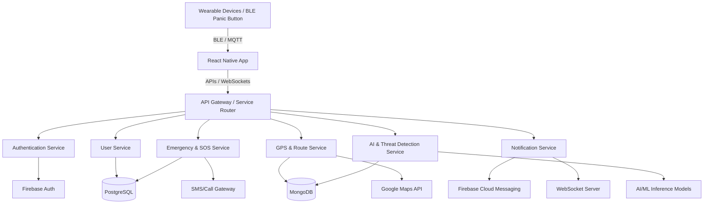

# Smart Women Security Application (Aegis)

An advanced emergency response and personal safety system using Artificial Intelligence (AI), IoT integration, Cloud Computing, and real-time communication. This system predicts unsafe situations, detects threats using behavioral patterns and sensor data, monitors routes, and coordinates immediate alerts to emergency contacts and law enforcement.

## System Architecture



---

## 20 Major Functional Modules

1. **User Registration & Authentication**: OTP mobile verification, Secure login (JWT & Bio-auth), Medical history (Blood group, allergies, conditions).
2. **Emergency Contact Management**: Priority-based contacts, family groups, direct hotlines (Police: 112, Women Helpline: 1091).
3. **Smart SOS Module**: Multi-trigger execution (one-touch, shake phone, voice trigger, power button tap, BLE wearable button).
4. **Live GPS Tracking**: Real-time telemetry, location sharing to trusted circle, geofencing safety boundaries.
5. **AI Threat Detection**: Anomaly movement detector (running, sudden stops, fall-down triggers) and night-monitoring safety alerts.
6. **Audio Recording Module**: Auto-activation upon SOS, noise reduction, and encrypted cloud upload.
7. **Video Recording**: Dual camera stream capture to cloud storage for tamper-proof legal evidence.
8. **Fake Call Generator**: Schedule custom calls with realistic audio playback to assist in escape situations.
9. **AI Chatbot Assistant**: Safe-walk tips, immediate first aid, map directions to nearby police/hospitals, legal rights resources.
10. **Safe Route Recommendation**: AI pathfinding utilizing crime maps, street lighting parameters, density estimation, and active patrol zones.
11. **Risk Zone Prediction**: Dynamic danger level scoring for neighborhoods (Safe, Moderate, High) updated by time of day and crime feeds.
12. **Crowd-Sourced Incident Reporting**: File verified geo-tagged safety flags (harassment, stalking, poor lighting) with photo/video.
13. **Nearby Emergency Services**: Instant lookup and maps routing for Hospitals, Police stations, NGOs, and Public transport hubs.
14. **Wearable Device Integration**: BLE connections to rings, smartwatches, and fitness bands tracking heart-rate anomalies.
15. **AI Voice Recognition**: Offline voice parsing targeting phrase commands ("Help me", "Emergency") utilizing background listening.
16. **Face Recognition**: Identifying verified family members, missing persons, or known high-risk offender watchlists.
17. **Cloud Evidence Storage**: E2E encrypted files backups stored securely on AWS S3 / Azure Blob Storage.
18. **AI Behavior Analysis**: Suspicious movement logs, repeated follow-backs, or unusual physical stalling alerts.
19. **Incident Timeline**: Immutable records log for SOS timestamp, GPS logs, SMS triggers, and media records for legal validation.
20. **Administrative Dashboard**: Operations panel for analytical mapping, crime hotspots visualization, and service alerts monitoring.

---

## Technology Stack

| Layer | Technology |
| :--- | :--- |
| **Mobile App** | React Native (Expo) |
| **Backend Services** | FastAPI (Python 3.10+) |
| **Databases** | PostgreSQL (Relational), MongoDB (Spatial/GeoJSON) |
| **AI/ML Engine** | PyTorch, Scikit-learn, TensorFlow |
| **Computer Vision** | OpenCV, MediaPipe |
| **NLP & Chatbot** | spaCy, HuggingFace Transformers |
| **Notifications** | Firebase Cloud Messaging (FCM) |
| **IoT Connectivity** | MQTT (Eclipse Mosquitto), BLE |
| **Cloud Storage** | MinIO (AWS S3 Compatible) |

---

## Repository Layout

```text
├── docs/                     # Design docs, architecture details, and API schemas
├── frontend/                 # React Native Mobile App codebase (Expo)
├── backend/                  # FastAPI Microservices
│   ├── authentication-service/
│   ├── user-service/
│   ├── emergency-service/
│   ├── gps-service/
│   ├── notification-service/
│   └── ai-service/
├── database/                 # SQL schemas, Mongo init scripts, and seed files
├── deployment/               # Deployment manifests (Docker & Kubernetes)
│   ├── docker/               # docker-compose and local config files
│   └── kubernetes/           # K8s YAML deployment specs
└── tests/                    # Integration and system tests
```

---

## Quick Start (Local Development)

### 1. Prerequisites
- Docker & Docker Compose
- Node.js v18+ & npm
- Python 3.10+

### 2. Startup Backend Infrastructure
Run the following from the root directory:
```bash
docker-compose -f deployment/docker/docker-compose.yml up --build -d
```
This launches:
- PostgreSQL (`localhost:5432`)
- MongoDB (`localhost:27017`)
- MQTT Broker (`localhost:1883`)
- FastAPI Gateway & Services

### 3. Launch Mobile Application
```bash
cd frontend
npm install
npx expo start
```
